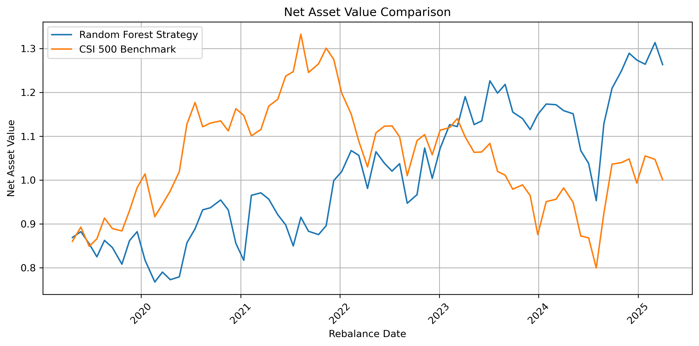

# Replication of the research report titled "Construction of Multi-Factor Stock Selection Model Based on Random Forest"


This project reproduces a sell-side quantitative research report by building a Random Forest-based multi-factor stock selection model and implementing a concentrated index enhancement strategy on CSI 500 constituents.


The full pipeline includes:


\- Data collection

\- Factor construction

\- Label generation (20-day forward excess return)

\- Cross-sectional preprocessing

\- RandomizedSearchCV with time-series cross-validation

\- Portfolio construction \& backtesting

\- Performance evaluation \& visualization


---


## 1. Strategy Overview


### Universe

\- CSI 500 constituents (dynamic, point-in-time)

\- Period: 2010-01-04 to 2025-04-30

\- Rebalance frequency: Every 20 trading days


### Model

\- Random Forest Classifier

\- Hyperparameters tuned using RandomizedSearchCV

\- Time-series cross-validation (no look-ahead bias)


### Label Definition


Binary classification based on 20-day forward excess return:


\- Top 30% → Label = 1

\- Bottom 30% → Label = 0

\- Middle 40% → Dropped


$$
y_{i,t} = R_{i,t \rightarrow t+20} - R_{index,t \rightarrow t+20}
$$


---


\## 2. Factor Construction


| Factor       | Description |
|:------------:|:------------|
| mom_20d      | 20-day momentum (percentage price change over past 20 trading days) |
| mom_60d      | 60-day momentum (percentage price change over past 60 trading days) |
| ep           | Earnings-to-Price ratio: 1 / PE_TTM |
| bp           | Book-to-Price ratio: 1 / PB |
| turnover_20d | 20-day average turnover ratio |
| OBV          | On-Balance Volume: cumulative volume adjusted by price direction |
| MA_5         | 5-day Moving Average of closing price |
| MA_10        | 10-day Moving Average of closing price |
| MA_20        | 20-day Moving Average of closing price |
| RSI_14       | 14-day Relative Strength Index |
| RSI_21       | 21-day Relative Strength Index |
| WILLR_14     | 14-day Williams %R oscillator |


### Preprocessing (Cross-Sectional, by Trade Date)


1. Winsorization (1%–99%)

2. Median imputation

3. Z-score standardization

4. Cross-sectional PCA


---


## 3. Model Training


Hyperparameter tuning performed via:


\- RandomizedSearchCV

\- TimeSeriesSplit (by trade_date)

\- Training period only


This avoids:


\- Look-ahead bias

\- Data leakage

\- Overfitting across time


---


## 4. Portfolio Construction


At each rebalance date:


1. Select current CSI 500 constituents

2. Predict probability of positive excess return

3. Rank by predicted probability

4. Select Top 10 stocks

5. Equal-weight allocation

6. Hold for 20 trading days


---


## 5. Backtest Results


### Net Asset Value Comparison





---


### Performance Summary


Performance comparison:


| Metric | RF Strategy | CSI 500 |
|--------|------------|---------|
| Total Return | 62.08% | 0.0669% |
| Annualized Return | 8.570% | 0.0115% |
| Annualized Volatility | 20.6% | 18.9% |
| Sharpe Ratio | 0.5 | 0.09 |
| Max Drawdown | 22.3% | 40.0% |
| Calmar Ratio | 0.4 | 0.0003 |


---


## 6. Project Structure


```text
rf-multifactor-replication/
  └─├─.gitignore
    ├─README.md
    ├─data
    │  ├─interim
    │  │   panel_with_factors.parquet
    │  │   panel_with_labels.parquet
    │  └─raw
    │      index_components_000905_SH.parquet
    │      index_daily_000905_SH.parquet
    │      rebalance_dates.csv
    │      stock_daily_basic_cs500.parquet
    │      stock_daily_cs500.parquet
    │      trade_calendar.parquet
    │      universe_cs500.csv
    │   
    ├─models
    │   rf_model_final.joblib
    │   rf_randomsearch_cv_results.csv
    ├─outputs
    │   backtest_result.parquet
    │   nav_comparison.png
    │   performance_table.csv
    ├─references
    │   基于随机森林的多因子选股模型构建-渤海证券-250630.pdf
    └─src
        backtest.py
        build_factors.py
        build_labels.py
        config.py
        download.py
        factors.py
        performance_report.py
        plot_nav.py
        preprocess.py
        train_model.py
        tushare_client.py
        __init__.py
```


## 7. Key Features


\- ✔ Point-in-time index constituents

\- ✔ Time-series cross-validation

\- ✔ No data leakage

\- ✔ Fully reproducible pipeline

\- ✔ Research-grade backtest metrics


---


## 8. Future Extensions


\- Rolling window re-training

\- Transaction cost modeling

\- Risk-neutral portfolio optimization

\- Feature importance stability analysis

\- Comparison with Logistic / XGBoost


---


## 9. Disclaimer


This project is for academic and research purposes only.  

Past performance does not guarantee future results.


---


## Author


Justin Zhang  

GitHub: CopperofAsia

